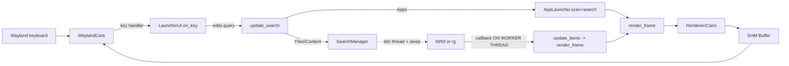

# waylaunch — Architecture Review & Design Roadmap

> **Scope of project (stated goal):** a faithful macOS **Spotlight** clone —
> functionally and visually — for Wayland compositors (Hyprland/wlroots), with
> **minimal resource usage**.
>
> **Scope of this document:** an honest review of the current architecture,
> maintainability, extensibility, and use of design principles (DRY / KISS /
> SOLID), followed by a target architecture and a phased roadmap.

---

## 1. Executive summary

The project has a solid *low-level* foundation — a hand-rolled Wayland client, a
Cairo/Pango renderer, a subprocess wrapper, a TOML config loader, and a small
recursive-descent calculator. Those pieces are individually competent.

However, the codebase is **pulled in two directions at once** and the seams show:

1. **Two applications live in one repo, and one of them is dead.** The shipped
   binary is a *Spotlight launcher* (`main.cpp → LauncherUI`). But roughly half
   the source — an entire *macOS Finder* file browser (`src/browser/*`, most of
   `src/ui/*`, `src/search/finder_search.cpp`, `src/core/keyboard_shortcuts.cpp`)
   — is **compiled and unit-tested but never instantiated at runtime**. There is
   no `FinderUI`; the `src/ui/finder_ui.cpp` that would wire it up was staged in
   git and then deleted. This is ~2,500+ LOC of dead weight.

2. **The two loudest project promises are currently false.**
   - *"Minimal resources / no GTK/Qt"* — the build **hard-requires and links
     GTK 3, gdk-pixbuf, and librsvg** (`CMakeLists.txt:17-19`), and the icon
     loader spins up a fresh `GtkIconTheme` per cache miss. `ldd build/waylaunch`
     shows `libgtk-3`.
   - *"Layer-shell overlay"* — both protocol XMLs are checked in as
     `*.xml.disabled`, so `HAS_LAYER_SHELL` is never defined and the app falls
     back to a normal `xdg_toplevel` window. As shipped it is **not an overlay**,
     so it cannot behave or float like Spotlight.

3. **There are a handful of real correctness bugs** in the live path — most
   importantly Wayland rendering being driven from a background thread (data
   race), a full filesystem/`.desktop` rescan on every keystroke, and launching
   via `system()` with unescaped paths.

None of this is fatal. The right move is to **pick one identity (Spotlight),
delete or quarantine the other, wire the promises to reality, and introduce a
few small abstractions** (a mode/result-provider interface, a single-threaded
event loop, a rendering helper). The roadmap in §7 sequences that work.

**Overall grade:** good primitives, unfocused architecture. `C+` today; the
foundation supports an `A-` with the refactors below.

---

## 2. Current architecture (as-is)

### 2.1 What actually runs

```
main.cpp
  └─ Config::load()                         (config/config.cpp, toml++)
  └─ LauncherUI::init/run                   (ui/launcher_ui.cpp)   ← the whole app
        ├─ WaylandCore                      (core/wayland_core.cpp)  display, shm, input, xdg
        ├─ Renderer                         (ui/renderer.cpp)        Cairo/Pango + GTK icons
        ├─ SearchManager                    (search/search_manager.cpp)
        │     ├─ FdFzfBackend  → Subprocess(fd | fzf)
        │     └─ RipgrepBackend → Subprocess(rg --json)
        ├─ AppLauncher                      (modes/app_launcher.cpp) .desktop scan
        ├─ Calculator                       (modes/calculator.cpp)   recursive-descent
        └─ Clipboard                        (modes/clipboard.cpp)    wl-copy
```

### 2.2 What is compiled but never reached (dead island)

Verified: nothing on the `main → LauncherUI` path references any of these, and
there is no class that composes them.

```
src/browser/file_model.cpp      src/ui/sidebar.cpp       src/ui/tabs.cpp
src/browser/file_ops.cpp        src/ui/toolbar.cpp       src/ui/view_modes.cpp
src/browser/tags.cpp            src/ui/info_panel.cpp    src/ui/sort_menu.cpp
src/browser/batch_rename.cpp    src/ui/status_bar.cpp    src/ui/preview.cpp
src/browser/drag_drop.cpp       src/search/finder_search.cpp
src/core/keyboard_shortcuts.cpp  (ShortcutAction/KeyboardShortcuts: zero live users)
```

The unit tests (`tests/`) almost exclusively exercise **this dead half**
(`test_file_model`, `test_file_ops`, `test_tags`, `test_keyboard_shortcuts`,
`test_ui_components`). Coverage is inverted: the code that ships is largely
untested; the code that doesn't ship is.

### 2.3 Runtime data flow (live path)



The dashed/marked edge is the core defect: **the search worker thread calls
`render_frame()`**, which touches Cairo *and* Wayland (`acquire_buffer`,
`wl_surface_attach/commit`) concurrently with the main thread's
`wl_display_dispatch`.

---

## 3. Design-principle assessment

### 3.1 DRY — repetition

| # | Where | Duplication |
|---|-------|-------------|
| D1 | `renderer.cpp` `draw_text`, `draw_text_segments`, `text_width`, `draw_input_box` cursor, `draw_icon` monogram | The Pango boilerplate (create layout → new font desc → set family/size/weight → set text → measure/show → free desc → unref layout) is copy-pasted **5×**. One `with_layout(font, text, fn)` helper removes all of it. |
| D2 | `renderer.cpp` `rounded_rect` vs `round_rect_path` | Same arc geometry written twice; `rounded_rect` should call `round_rect_path` then `fill`. |
| D3 | `wayland_core.cpp` `acquire_buffer` vs `handle_xdg_surface_configure` | The full SHM alloc sequence (`shm_open`/`ftruncate`/`mmap`/`create_pool`/`create_buffer`) is duplicated verbatim. Extract `Buffer::allocate(shm, w, h)`. |
| D4 | `app_launcher.cpp` `search()` | Lowercasing done 4× per entry per call; and `FuzzyMatcher` already exists in `search_manager.h` but Apps mode ignores it and rolls its own substring match. Two matching implementations, neither shared. |
| D5 | `launcher_ui.cpp` `render_frame` | The "icon + name + description row" block is written twice (hero row and list rows) with slightly different offsets. |

### 3.2 KISS / YAGNI — accidental complexity

- **K1 — Empty stubs shipped as translation units.** `modes/file_search.cpp` and
  `modes/content_search.cpp` contain only comments (228 / 214 bytes) yet are
  compiled and listed in `CMakeLists.txt`. Delete or fill.
- **K2 — Two competing renderer APIs.** `Renderer::render_into(... LayoutMetrics,
  RenderItem, TextSegment ...)` is a complete generic list renderer that **nothing
  calls** — `LauncherUI` instead drives the immediate-mode primitives directly.
  One of the two models should go (keep the immediate-mode primitives; delete
  `render_into`, `LayoutMetrics`, `RenderItem`, `TextSegment` unless the Finder
  is revived).
- **K3 — The Finder subsystem is speculative scope.** View modes (List/Icon/
  Column/Gallery), tags, batch rename, drag-drop, tabs, info panel — none of it
  is part of "Spotlight." It is a second product built ahead of need.
- **K4 — Debounce via thread-that-sleeps.** `SearchManager::search` spawns a
  `std::thread` that `sleep_for(debounce_ms)`; the next keystroke calls
  `cancel()` which **`join()`s** the in-flight thread. A blocking `fd|fzf` mid-run
  therefore stalls the UI thread on every keystroke. A `timerfd` in the main
  `poll()` loop is both simpler and correct (see §5.2).

### 3.3 SOLID

- **S — Single Responsibility:**
  - `LauncherUI` owns input parsing, UTF-8 editing, mode state, theme building,
    layout math, drawing, hit-testing, *and* process launching. `render_frame()`
    is ~165 lines interleaving layout arithmetic with draw calls and magic
    numbers (`glyph_size = 26`, `sf.size = 22`, `- 180`, `+ 14`). Split into
    `Layout` (pure geometry) + `render` (pure drawing) + `Launcher` (exec).
  - `WaylandCore` exposes **almost every member public** ("for C trampolines").
    Encapsulation is effectively off. Trampolines only need `this` + one setter;
    keep state private and pass through handler methods.
- **O — Open/Closed:** Adding a mode today means editing **six** places: the
  `LauncherModeType` enum, `toggle_mode()`'s `% 4`, `set_mode()`, `update_search()`,
  the group-label ternary, and `panel_height()`. There is no mode abstraction.
  (Contrast: `SearchBackend` *is* a clean OCP interface — the right pattern, not
  yet applied to modes.)
- **L — Liskov:** fine where polymorphism exists (`SearchBackend`).
- **I — Interface Segregation:** `SearchBackend` is well-segregated. `WaylandCore`'s
  public surface is the opposite.
- **D — Dependency Inversion:** `LauncherUI` `new`s its concretes
  (`WaylandCore`, `Renderer`, `SearchManager`, and per-call `AppLauncher`,
  `Calculator`, `Clipboard`). No seams for testing. Depend on small interfaces
  (a `ResultProvider`, a `Surface`, a `Launcher`) injected at construction.

### 3.4 Extensibility & maintainability

- **Config ↔ code are badly out of sync.** The TOML schema advertises
  `[[bindings.keys]]`, `[[modes.list]]`, `[[commands]]`, `[window]`,
  `[platform].use_layer_shell`, `history_*` — and the loader parses all of it —
  but `LauncherUI` **ignores** bindings (keys hardcoded in `on_key`), ignores the
  modes list (hardcoded enum + `% 4`), never surfaces `commands`, never applies
  `window.*` (uses its own hardcoded `SpotlightLayout`), and never reads
  `use_layer_shell`. Most of the config file is decorative. Either wire it or
  cut it — a config that silently does nothing is a maintenance trap.
- **Identity drift in docs.** `README.md`'s Architecture section lists files that
  don't exist (`buffer.cpp`, `fuzzy_matcher.cpp`) and omits everything real
  (`browser/*`, half of `ui/*`). The repo dir is `finder/`, the product is
  `waylaunch`, and a `FinderSearch` class targets a browser that isn't shipped.

---

## 4. Correctness & robustness findings (live path)

Ordered by severity. These are concrete bugs, not style.

| ID | Severity | File / symbol | Problem | Fix direction |
|----|----------|---------------|---------|---------------|
| B1 | **High** | `search_manager.cpp` → `launcher_ui.cpp:update_items` | Search **worker thread calls `render_frame()`**, touching Cairo + Wayland concurrently with the main-thread `wl_display_dispatch`. Data race on `items_`, and libwayland object calls from two threads → intermittent crashes/protocol errors. | Never render off-thread. Post results back to the main loop (eventfd/pipe wake, then render there). See §5.2. |
| B2 | **High** | `launcher_ui.cpp:refresh_applications` | Constructs a new `AppLauncher` and **re-scans every XDG dir and re-parses every `.desktop` file on every keystroke** (called from `update_search` in Apps mode). Directly violates the minimal-resources goal. | Scan once at startup into a cached vector; filter in memory per keystroke. |
| B3 | **High** | `launcher_ui.cpp:launch_selected` | Launch via `system("xdg-open \"" + path + "\" &")` and `system(exec + " &")`. Paths/args with `"`, `$`, spaces, `;` break or inject. Desktop `Exec` field codes and `Terminal=true` aren't handled. | Launch with `posix_spawn`/`fork+exec` and an argv vector (you already have `Subprocess`); parse `Exec` per the Desktop Entry spec; double-fork to detach. |
| B4 | Medium | `search_manager.cpp:cancel` | `cancel()` `join()`s the in-flight worker, so the UI thread blocks up to `debounce_ms` + subprocess time per keystroke (K4). | Replace thread+sleep with a `timerfd` in the main `poll()`; run backends async, cancel by ignoring stale results (an id you already track). |
| B5 | Medium | `renderer.cpp:load_icon_surface` (pixbuf→surface) | Copies `p[0],p[1],p[2]` (R,G,B) straight into Cairo `ARGB32`, which on little-endian is **B,G,R,A** → red/blue swapped, and alpha isn't pre-multiplied → wrong edges on transparent icons. | Swap R/B (or use `gdk_cairo_set_source_pixbuf`) and pre-multiply alpha. |
| B6 | Medium | `wayland_core.cpp:acquire_buffer` | `shm_open` uses the **literal** name `"/wl_shm-XXXXXX"` (not `mkstemp`-templated). Two concurrent buffers/instances racing before `shm_unlink` → `EEXIST`. Also `ftruncate`/`pipe`/`write` return values are ignored (`-Wunused-result`). | Use `memfd_create` (with `MFD_CLOEXEC`), or randomize the name; check syscall returns. |
| B7 | Low | `launcher_ui.cpp:render_frame` (Calc) | A `Calculator` is constructed and the expression re-evaluated **every frame** in calculator mode. | Evaluate on query change; cache the `Result`. |
| B8 | Low | `subprocess.cpp:run` | `pipe()` results unchecked; if `stdin_data` is larger than the pipe buffer (64 KB) the single `write()` before `close` can block/short-write since the child may not be draining yet. Fine for current inputs, latent for large `fd` lists piped to `fzf`. | Check returns; write in the poll loop or use a writer thread for large payloads. |

---

## 5. Target architecture (to-be)

Keep the good primitives; add three small seams; delete the second product.

### 5.1 Module boundaries

```
core/         WaylandCore (private state), Buffer, event loop (poll over wl_fd + timerfd + result_fd)
gfx/          Renderer (immediate-mode Cairo/Pango primitives + with_layout helper), IconLoader
input/        KeyMap: config bindings → Action enum (replaces hardcoded on_key + revives config)
app/          SpotlightController: query/selection state, orchestrates providers, owns layout
providers/    ResultProvider interface + AppProvider, FileProvider, ContentProvider,
              CalculatorProvider, CommandProvider   (each is OCP-pluggable)
platform/     Launcher (posix_spawn), Clipboard, DesktopEntry parser
config/        Config (unchanged, but now actually consumed)
```

### 5.2 The one abstraction that fixes the most: `ResultProvider`

Modes become data, not `switch` statements. Adding "emoji" or "web search" later
is a new class + one registration line — nothing else changes (OCP + SRP + DIP).

```cpp
struct Query { std::string text; int max_results; };

class ResultProvider {
public:
  virtual ~ResultProvider() = default;
  virtual std::string id() const = 0;          // "applications", "files", ...
  virtual std::string group_label() const = 0; // "APPLICATIONS"
  virtual bool is_available() const = 0;       // e.g. fd/rg present
  // Called on a worker; MUST NOT touch Wayland/Cairo. Returns via the sink,
  // which marshals back to the main thread.
  virtual void query(const Query&, std::function<void(std::vector<ListItem>)> sink) = 0;
  virtual void activate(const ListItem&) = 0;  // launch / copy / open
};
```

`SpotlightController` holds `std::vector<std::unique_ptr<ResultProvider>>` built
from `[[modes.list]]`. `Tab` cycles the enabled ones; results always land on the
main thread; `render` is a pure function of `(query, items, selection, layout)`.

### 5.3 Single-threaded event loop (removes B1 & B4)

```cpp
// core/event_loop
int wl_fd  = wl_display_get_fd(display);
int tmr_fd = timerfd_create(CLOCK_MONOTONIC, TFD_NONBLOCK|TFD_CLOEXEC); // debounce
int res_fd = eventfd(0, EFD_NONBLOCK|EFD_CLOEXEC);                      // worker → main wake

poll({wl_fd, tmr_fd, res_fd}):
  wl_fd  ready → wl_display_dispatch (input, configure)
  tmr_fd fires → kick provider->query on a worker (or async subprocess)
  res_fd ready → drain completed results, render on THIS thread
```

Rendering only ever happens on the thread that owns the Wayland connection.
Debounce is a `timerfd`, not a sleeping thread. Cancellation is "drop results
whose id != current" (the id counter already exists).

### 5.4 Faithful-Spotlight requirements (visual + behavioral)

- **Layer-shell overlay is mandatory**, not optional. Un-disable
  `protocols/wlr-layer-shell-unstable-v1.xml`, make `HAS_LAYER_SHELL` the primary
  path, `xdg_toplevel` only a dev fallback. Anchor top-center, `OVERLAY` layer,
  `EXCLUSIVE` keyboard, no exclusive zone. Honor `platform.use_layer_shell`.
- **Overlay ergonomics:** dismiss on focus-loss / `Esc`, single-instance (a lock
  so re-invoking toggles rather than stacking), instant show (pre-warm caches).
- **Look:** translucent panel + drop shadow already sketched; add the Spotlight
  result grouping ("Top Hit" + category sections), large first-line/secondary-line
  rows, right-aligned metadata, and a preview pane later.

### 5.5 Resource-usage plan (the headline promise)

- **Drop GTK entirely.** It's pulled in only for icon-theme lookup. Replace with a
  tiny freedesktop icon resolver (parse `index.theme`, walk
  `hicolor`/current-theme dirs) + load PNG via a light path and SVG via
  **librsvg alone** (or `nanosvg`). Removing `gtk+-3.0` and `gdk-pixbuf` is the
  single biggest RSS win and makes the README true.
- Scan `.desktop` once; `mmap`-free string parsing is fine at this scale.
- Reuse SHM buffers (already double-buffered) and only damage the panel rect.

---

## 6. Testing strategy

Current tests validate the dead Finder. Re-point them at what ships:

- **Pure logic (host-buildable, no Wayland):** `Calculator` (currently *untested*
  despite being the most test-friendly unit — precedence, unary, functions,
  div-by-zero, degrees), `DesktopEntry` parser, `FuzzyMatcher`/ranking, config
  round-trip, path expansion (`~`, `$XDG_*`).
- **Providers:** table-driven tests with a fake `Subprocess` so `fd/fzf/rg`
  parsing is covered without the binaries.
- **Golden-image render tests:** render to an off-screen Cairo surface and hash
  the buffer — catches layout regressions and the B5 color bug.
- Keep the `waylaunch_core` static-lib split (good idea) but rebuild it from the
  **live** sources.

---

## 7. Roadmap

Each phase is independently shippable and leaves `main` runnable.

### Phase 0 — Decide identity & stop the bleeding (0.5–1 day)
- [ ] **Decision:** Spotlight-only now; move the Finder to a `finder/` branch or
      `experimental/` dir. *(Blocks everything; see the open question in §8.)*
- [ ] Delete empty stubs `modes/file_search.cpp`, `modes/content_search.cpp`.
- [ ] Remove `render_into`/`LayoutMetrics`/`RenderItem`/`TextSegment` (K2) unless Finder stays.
- [ ] Fix `README.md` to match reality (deps, architecture tree, layer-shell status).

### Phase 1 — Make the promises true (2–3 days)
- [ ] Un-disable layer-shell; overlay becomes the primary surface (§5.4).
- [ ] Remove the GTK/gdk-pixbuf dependency; minimal icon resolver + librsvg (§5.5).
- [ ] Single-instance guard + dismiss-on-focus-loss.

### Phase 2 — Fix the live-path bugs (2–3 days)
- [ ] B1/B4: single-threaded `poll()` loop with `timerfd` + `eventfd` (§5.3).
- [ ] B2: scan `.desktop` once, filter in memory.
- [ ] B3: `posix_spawn` launcher + proper `Exec`/`Terminal` handling.
- [ ] B5 (color), B6 (memfd/return checks), B7 (calc caching).

### Phase 3 — The one refactor that pays off (3–5 days)
- [ ] Introduce `ResultProvider` (§5.2); port Apps/Files/Content/Calculator to it.
- [ ] Extract `Layout` (pure geometry) out of `render_frame`; add `with_layout` (D1).
- [ ] Make `WaylandCore` members private; trim the public surface.

### Phase 4 — Wire config → behavior (2–3 days)
- [ ] `KeyMap`: drive keys from `[[bindings.keys]]` (retire hardcoded `on_key`).
- [ ] Build the mode list from `[[modes.list]]`; honor `enabled`.
- [ ] Apply `[window]`/`[theme]` to the actual layout; surface `[[commands]]` as a provider.
- [ ] Delete any config keys that remain unwired (don't ship decorative config).

### Phase 5 — Spotlight fidelity & polish (ongoing)
- [ ] Result grouping (Top Hit + sections), preview pane, query history, frecency ranking.
- [ ] Golden-image + logic test suites (§6); CI.
- [ ] *(Optional, deliberate)* revive the Finder as a **separate binary** sharing `core/`+`gfx/`.

### Quick wins (any time, < 1 hr each)
Delete stubs · fix README · `rounded_rect`→`round_rect_path` (D2) · cache the
calc result (B7) · check syscall returns (B6/B8).

---

## 8. Open questions for the maintainer

1. **Identity — RESOLVED (2026-07-18): Spotlight-only.** The product is a
   Spotlight launcher that, *where meaningful*, supports **right-click → reveal
   file location** in the system file manager. The macOS Finder browser is **not**
   part of the product. The dead `src/browser/*`, `finder_search`,
   `keyboard_shortcuts`, and the browser-only `src/ui/*` components should be
   deleted or moved to an `experimental/` branch (Phase 0). *Implemented so far:*
   right-click on a Files/Content result calls
   `LauncherUI::open_file_location()`, which uses the freedesktop
   `FileManager1.ShowItems` D-Bus call (reveals + selects the file) with an
   `xdg-open`-on-enclosing-folder fallback. It launches via a detached,
   argv-based spawn — the safe pattern that B3 should adopt everywhere.
2. **`fzf` as a runtime dependency:** piping the whole `fd` output through `fzf`
   per keystroke is heavy and non-deterministic to rank. Prefer `fd` for
   enumeration + the in-process `FuzzyMatcher` for filtering/ranking?
3. **Minimum compositor target:** wlroots-only (layer-shell guaranteed), or must
   the `xdg_toplevel` fallback stay first-class for GNOME/KDE?
```
